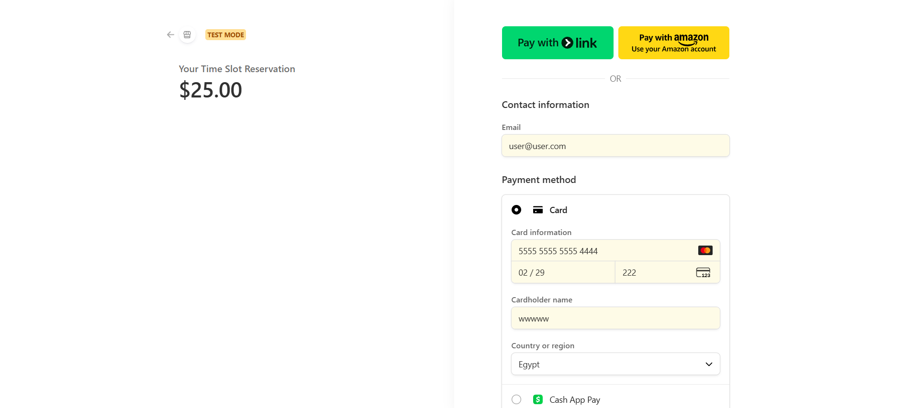
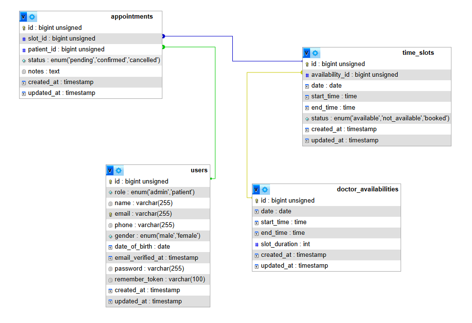

# Clinic Appointment Booking System

<div align="center">


**A Full-Stack Web Application for Clinic Appointment System with Integrated Payment Gateway**

[Features](#-features) • [Screenshots](#-screenshots) • [Installation](#-installation) • [API Docs](#-api-documentation)

</div>

---

## Overview

Clinic Appointment Booking System is a comprehensive solution that enables patients to book appointments with doctors seamlessly. The system features role-based access control (Admin/Patient), dynamic time slot management, **secure online payment processing via Stripe**, and a complete authentication system with email verification and password recovery.

---

## Features

### Architecture

- **RESTful API**
- **Separation of concerns** (Admin / Patient)
- **Token-based authentication**
- **Secure payment processing**

### Authentication & Security

- **User Registration** with email verification
- **Secure Login** with Laravel Sanctum tokens
- **Password Recovery** via email link
- **Email Verification** system
- **Role-based Access Control** (Admin/Patient)
- **PCI-compliant payment processing** via Stripe

### Payment Integration

- **Stripe Payment Gateway** - Secure online payment processing
- **Consultation Fee Payment** - Patients pay when booking appointments
- **Payment Confirmation** - Instant booking confirmation after successful payment
- **Refund Support** - Automatic refund processing for cancelled appointments
- **Webhook Integration** - Real-time payment status updates

### Admin Dashboard

- **Availability Management** - Set working hours and dates
- **Dynamic Time Slot Generation** - Auto-generate slots based on duration
- **Appointment Overview** - View and manage all bookings
- **Refund Management** - Process refunds for cancelled appointments
- **CRUD Operations** for all resources

### Patient Features

- **Browse Available Slots** - View all open time slots
- **Book Appointments** - Reserve time slots after payment confirmation
- **Cancel Bookings** - Cancel appointments with automatic refund
- **Secure Payment** - Pay consultation fees via Stripe
- **Payment Receipts** - Download payment invoices

---

## Tech Stack

| Technology          | Purpose                     |
| ------------------- | --------------------------- |
| **Laravel 12+**     | PHP Framework               |
| **PHP 8.2+**        | Programming Language        |
| **MySQL**           | Database                    |
| **Laravel Sanctum** | API Authentication          |
| **Stripe API**      | Payment Gateway             |
| **Vue.js 3**        | Frontend Framework          |
| **Postman**         | API Testing & Documentation |

---

## Screenshots

### Admin Dashboard (Doctor View)

|                                                Manage Availability                                                |                                              Manage Time Slots                                               |                                       Appointment Details & Patient Info                                        |
| :---------------------------------------------------------------------------------------------------------------: | :----------------------------------------------------------------------------------------------------------: | :-------------------------------------------------------------------------------------------------------------: |
|  <br><sub><b>Manage Availability</b></sub> |  <br><sub><b>Manage Time Slots</b></sub> |  <br><sub><b>Appointments List</b></sub> |

---

### User Dashboard (Patient View)

|                                        Home Screen                                        |                                            Book New Appointment                                            |                                           Payment Processing                                           |                                                My Appointments                                                |
| :---------------------------------------------------------------------------------------: | :--------------------------------------------------------------------------------------------------------: | :----------------------------------------------------------------------------------------------------: | :-----------------------------------------------------------------------------------------------------------: |
|  <br><sub><b>Home</b></sub> |  <br><sub><b>Book Appointment</b></sub> |  <br><sub><b>Stripe Payment</b></sub> |  <br><sub><b>My Appointments</b></sub> |

---

## API Documentation

### Authentication Endpoints

| Method | Endpoint                    | Description          |
| ------ | --------------------------- | -------------------- |
| POST   | `/api/auth/register`        | Register new user    |
| POST   | `/api/auth/login`           | User login           |
| POST   | `/api/auth/logout`          | User logout          |
| POST   | `/api/auth/forgot-password` | Send reset link      |
| POST   | `/api/auth/reset-password`  | Reset password       |
| POST   | `/api/auth/verify-email`    | Verify email address |

---

### Admin Endpoints

> **Note:** All admin endpoints require authentication with admin role.

#### Availability Management

| Method | Endpoint                         | Description             |
| ------ | -------------------------------- | ----------------------- |
| GET    | `/api/admin/availabilities`      | List all availabilities |
| POST   | `/api/admin/availabilities`      | Create new availability |
| PUT    | `/api/admin/availabilities/{id}` | Update availability     |
| DELETE | `/api/admin/availabilities/{id}` | Delete availability     |

#### Time Slots Management

| Method | Endpoint                     | Description             |
| ------ | ---------------------------- | ----------------------- |
| GET    | `/api/admin/time-slots`      | List all time slots     |
| POST   | `/api/admin/time-slots`      | Create single time slot |
| PUT    | `/api/admin/time-slots/{id}` | Update time slot        |
| DELETE | `/api/admin/time-slots/{id}` | Delete time slot        |

#### Appointments Management

| Method | Endpoint                       | Description           |
| ------ | ------------------------------ | --------------------- |
| GET    | `/api/admin/appointments`      | List all appointments |
| DELETE | `/api/admin/appointments/{id}` | Delete appointment    |

#### Payment Reports

| Method | Endpoint                   | Description          |
| ------ | -------------------------- | -------------------- |
| GET    | `/api/admin/payments`      | List all payments    |
| GET    | `/api/admin/payments/{id}` | View payment details |
| POST   | `/api/admin/refunds/{id}`  | Process refund       |

---

### Patient Endpoints

#### Get Available Time Slots (Public)

```http
GET /api/time-slots
```

#### Get User's Time Slots

```http
GET /api/user/time-slots
Authorization: Bearer {token}
```

#### Create Payment Intent

```http
POST /api/payments/create-intent
Authorization: Bearer {token}

{
    "slot_id": 61,
    "amount": 50.00
}
```

#### Book Appointment (After Payment)

```http
POST /api/appointments
Authorization: Bearer {token}

{
    "slot_id": 61,
    "payment_intent_id": "pi_xxxxx"
}
```

#### Cancel Appointment (With Refund)

```http
DELETE /api/appointments/{id}
Authorization: Bearer {token}
```

---

### Stripe Webhook Endpoint

```http
POST /api/webhooks/stripe
```

This endpoint handles real-time payment status updates from Stripe, including:

- Payment confirmations
- Refund notifications
- Failed payment alerts

---

## Testing with Postman

1. Import the Postman collection from `docs/apis/postman_collection.json`
2. Set up environment variables:
   - `baseURL`: `http://localhost:8000`
   - `adminToken`: Token received after admin login
   - `userToken`: Token received after user login

---

## Stripe Test Cards:

- Success: `4242 4242 4242 4242`
- Decline: `4000 0000 0000 0002`
- Authentication Required: `4000 0025 0000 3155`

---

## API Response Format

All API responses follow a consistent format:

### Success Response

```json
{
  "status": "success",
  "message": "Operation successful",
  "data": {}
}
```

### Error Response

```json
{
  "status": "error",
  "message": "Error description",
  "errors": {}
}
```

---

## Project Structure

### Backend - Laravel API

```
backend/
├── app/
│   ├── Exceptions/           # Exception Handler
│   ├── Http/
│   │   ├── Controllers/
│   │   │   ├── Admin/        # Admin controllers
│   │   │   ├── Auth/         # Authentication logic
│   │   │   ├── Payment/      # Payment processing
│   │   │   └── User/         # Patient controllers
│   │   ├── Middleware/
│   │   │   └── Admin/
│   │   ├── Requests/
│   │   │   ├── Admin/
│   │   │   ├── Auth/
│   │   │   └── User/
│   │   └── Resources/        # API response formatting
│   ├── Mail/                 # Email notifications
│   ├── Models/               # Eloquent models
│   ├── Policies/             # Authorization policies
│   ├── Services/             # Business logic layer
│   └── Traits/
├── routes/
│   ├── api.php               # API routes
│   ├── auth.php              # Auth routes
│   └── web.php
├── database/
│   ├── migrations/
│   ├── factories/
│   └── seeders/
```

### Frontend - Vue.js

```
frontend/
├── src/
│   ├── assets/
│   ├── components/
│   │   ├── Admin/
│   ├── layouts/
│   │   ├── Admin/              # Admin dashboard layouts
│   │   ├── User/               # Patient layouts
│   │   └── AuthLayout.vue
│   ├── router/
│   │   └── index.js            # Vue Router configuration
│   ├── views/
│   │   ├── Admin/              # Admin pages
│   │   ├── Auth/
│   │   └── User/               # Patient pages
│   ├── App.vue
│   └── main.js
```

---

## Database Schema (ERD)

The following diagram represents the Entity Relationship Diagram (ERD)
for the Clinic Appointment Booking System.



### Key Tables

- **users** - User accounts (patients and admins)
- **availabilities** - Doctor availability schedules
- **time_slots** - Available appointment slots with pricing
- **appointments** - Booked appointments
- **payments** - Payment transactions
- **refunds** - Refund records

---

## Installation Guide

### Prerequisites

- PHP 8.2 or higher
- Composer
- Node.js 18+ and npm
- MySQL 8.0+
- Stripe Account (for payment processing)

### Backend Setup (Laravel API)

#### 1. Clone Repository

```bash
git clone https://github.com/fathallah7/clinic-appointment-system
cd clinic-appointment-system/backend
```

#### 2. Install PHP Dependencies

```bash
composer install
```

#### 3. Environment Configuration

```bash
cp .env.example .env
php artisan key:generate
```

Edit `.env`:

```env
APP_NAME="Clinic Appointment System"
APP_URL=http://localhost:8000

DB_CONNECTION=mysql
DB_HOST=127.0.0.1
DB_PORT=3306
DB_DATABASE=clinic_appointment_system
DB_USERNAME=root
DB_PASSWORD=your_password

# Stripe Configuration
STRIPE_KEY=pk_test_xxxxxxxxxxxxxxxxxxxxx
STRIPE_SECRET=sk_test_xxxxxxxxxxxxxxxxxxxxx
STRIPE_WEBHOOK_SECRET=whsec_xxxxxxxxxxxxxxxxxxxxx

# Mail Configuration
MAIL_MAILER=smtp
MAIL_HOST=smtp.mailtrap.io
MAIL_PORT=2525
MAIL_USERNAME=your_username
MAIL_PASSWORD=your_password
MAIL_ENCRYPTION=tls
MAIL_FROM_ADDRESS=noreply@clinic.com
MAIL_FROM_NAME="${APP_NAME}"
```

#### 4. Get Stripe API Keys

1. Create a Stripe account at https://stripe.com
2. Go to **Developers** → **API keys**
3. Copy your **Publishable key** and **Secret key**
4. For webhooks:
   - Go to **Developers** → **Webhooks**
   - Add endpoint: `http://your-domain.com/api/webhooks/stripe`
   - Select events: `payment_intent.succeeded`, `payment_intent.payment_failed`, `charge.refunded`
   - Copy the **Signing secret**

#### 5. Database Setup

```bash
# Run migrations
php artisan migrate

# Seed database with sample data
php artisan db:seed
```

#### 6. Run Backend Server

```bash
php artisan serve
# API available at: http://localhost:8000
```

**Default Admin Credentials:**

```
Email: admin@doctor.com
Password: admin123
```

### Frontend Setup (Vue.js Dashboard)

#### 1. Navigate to Frontend Directory

```bash
cd ../frontend
# or
cd clinic-appointment-system/frontend
```

#### 2. Install Node Dependencies

```bash
npm install
```

#### 3. Configure Stripe

Create `.env` file:

```env
VITE_API_URL=http://localhost:8000
VITE_STRIPE_PUBLISHABLE_KEY=pk_test_xxxxxxxxxxxxxxxxxxxxx
```

#### 4. Run Development Server

```bash
npm run dev
# available at: http://localhost:3000
```

#### 5. Build for Production

```bash
npm run build
# Output in: dist/
```

---

## Payment Flow

### 1. Patient Books Appointment

```
User selects time slot → Creates payment intent → Stripe checkout opens
```

### 2. Payment Processing

```
User enters card details → Stripe processes payment → Webhook confirms payment
```

### 3. Appointment Confirmation

```
Payment confirmed → Appointment created → Confirmation email sent
```

### 4. Cancellation & Refund

```
User cancels appointment → Refund initiated → Refund processed → Confirmation email
```

---

## Security Features

- **PCI DSS Compliance** - Stripe handles all sensitive card data
- **HTTPS Required** - Secure data transmission
- **CSRF Protection** - Laravel built-in protection
- **API Token Authentication** - Sanctum tokens
- **Input Validation** - Server-side validation for all requests
- **SQL Injection Prevention** - Eloquent ORM protection
- **XSS Protection** - Vue.js automatic escaping
- **Webhook Signature Verification** - Validate Stripe webhooks

---

## Testing

### Run Backend Tests

```bash
cd backend
php artisan test
```

### Test Payment Integration

```bash
# Test with Stripe CLI
stripe listen --forward-to localhost:8000/api/webhooks/stripe

# Trigger test webhook
stripe trigger payment_intent.succeeded
```

---

## Troubleshooting

### Payment Issues

**Problem:** Payment not processing

- Verify Stripe API keys are correct
- Check webhook endpoint is accessible
- Ensure HTTPS is enabled in production

**Problem:** Webhook not working

- Verify webhook secret is correct
- Check webhook endpoint returns 200 status
- Review Stripe webhook logs in dashboard

### Common Errors

**Error:** "Invalid API Key"

- Check `.env` file has correct Stripe keys
- Run `php artisan config:cache` after updating

**Error:** "Webhook signature verification failed"

- Ensure webhook secret matches Stripe dashboard
- Verify endpoint URL is correct

---

## Author

**Abdullah Fathallah**

[](https://github.com/fathallah7)
[](https://linkedin.com/in/abdullahfathallah)
[](mailto:abdullahfathallah7@gmail.com)
