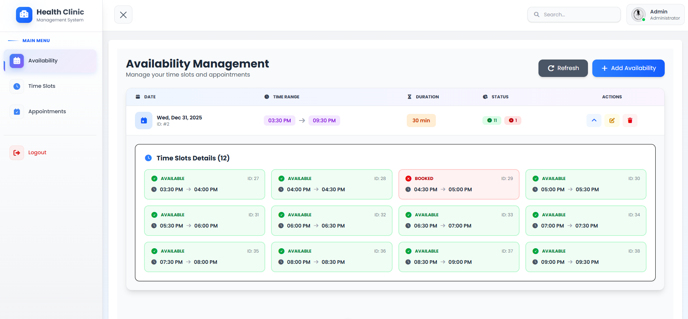
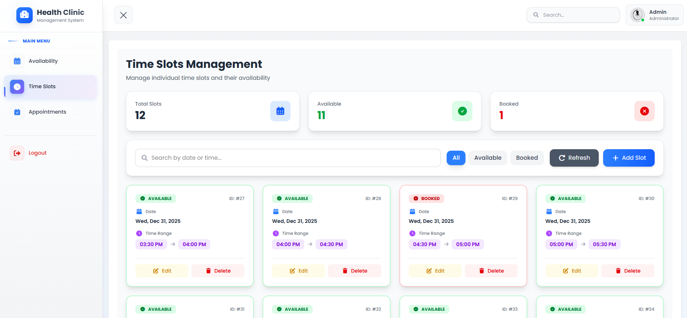
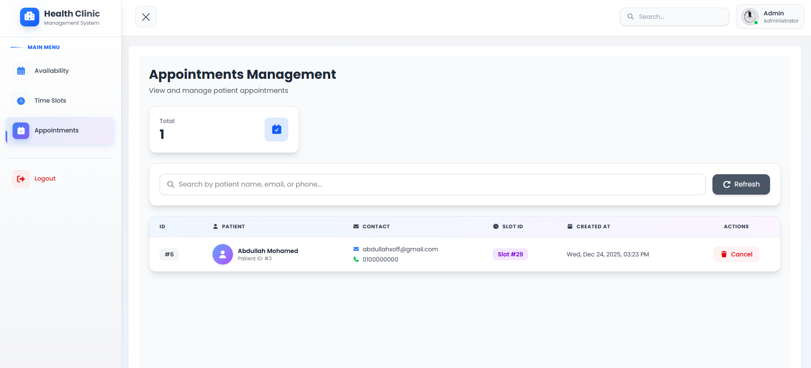
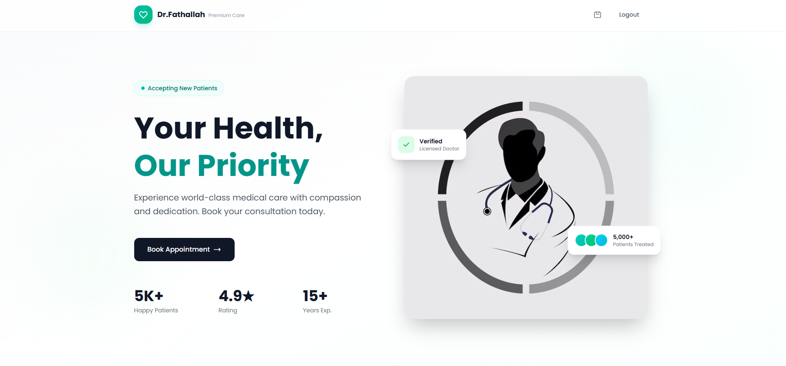
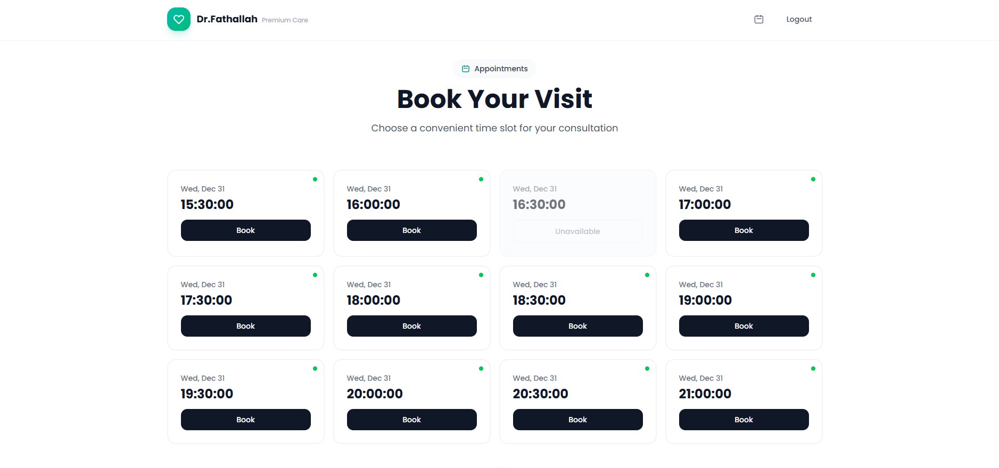
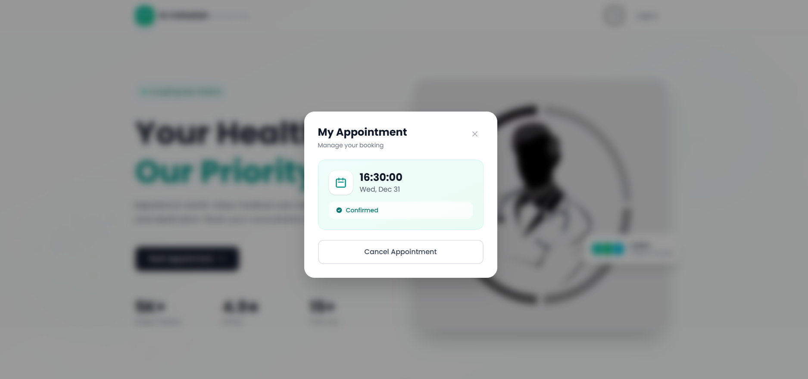

# 🏥 Clinic Appointment Booking System

<div align="center">


**A Full-Stack Web Application for Clinic Appointment System**

[Features](#-features) • [Screenshots](#-screenshots) • [Installation](#-installation) • [API Docs](#-api-documentation)

</div>

---

## Overview

Clinic Appointment Booking System is a comprehensive solution that enables patients to book appointments with doctors seamlessly. The system features role-based access control (Admin/Patient), dynamic time slot management, and a complete authentication system with email verification and password recovery.

---

## Features

### Architecture

- **RESTful API**
- **Separation of concerns** (Admin / Patient)
- **Token-based authentication**

### Authentication & Security

- **User Registration** with email verification
- **Secure Login** with Laravel Sanctum tokens
- **Password Recovery** via email link
- **Email Verification** system
- **Role-based Access Control** (Admin/Patient)

### Admin Dashboard

- **Availability Management** - Set working hours and dates
- **Dynamic Time Slot Generation** - Auto-generate slots based on duration
- **Appointment Overview** - View and manage all bookings
- **CRUD Operations** for all resources

### Patient Features

- **Browse Available Slots** - View all open time slots
- **Book Appointments** - Reserve time slots instantly
- **Cancel Bookings** - Cancel appointments when needed

---

## Tech Stack

| Technology          | Purpose                     |
| ------------------- | --------------------------- |
| **Laravel 12+**     | PHP Framework               |
| **PHP 8.2+**        | Programming Language        |
| **MySQL**           | Database                    |
| **Laravel Sanctum** | API Authentication          |
| **Postman**         | API Testing & Documentation |

---

## Screenshots

### Admin Dashboard (Doctor View)

|                                                                                                                                           |                                                                                                                               |                                                                                                                                                          |
| :---------------------------------------------------------------------------------------------------------------------------------------: | :---------------------------------------------------------------------------------------------------------------------------: | :------------------------------------------------------------------------------------------------------------------------------------------------------: | --- |
|  <br><sub><b>Manage Availability<b><sub> |  <br><sub><b>Manage Time Slots</b></sub> |  <br><sub><b>Appointment Details & Patient Info</b></sub> |     |

### User Dashboard (Patient View)

|                                                                                                                     |                                                                                                                                       |                                                                                                                                     |
| :-----------------------------------------------------------------------------------------------------------------: | :-----------------------------------------------------------------------------------------------------------------------------------: | :---------------------------------------------------------------------------------------------------------------------------------: |
|  <br><sub><b>Home Screen</b></sub> |  <br><sub><b>Book New Appointment</b></sub> |  <br><sub><b>My Appointments</b></sub> |

---

### Admin Endpoints

> **Note:** All admin endpoints require authentication with admin role.

#### Availability Management

| Method | Endpoint                         | Description             |
| ------ | -------------------------------- | ----------------------- |
| GET    | `/api/admin/availabilities`      | List all availabilities |
| POST   | `/api/admin/availabilities`      | Create new availability |
| PUT    | `/api/admin/availabilities/{id}` | Update availability     |
| DELETE | `/api/admin/availabilities/{id}` | Delete availability     |

#### Time Slots Management

| Method | Endpoint                     | Description             |
| ------ | ---------------------------- | ----------------------- |
| GET    | `/api/admin/time-slots`      | List all time slots     |
| POST   | `/api/admin/time-slots`      | Create single time slot |
| PUT    | `/api/admin/time-slots/{id}` | Update time slot        |
| DELETE | `/api/admin/time-slots/{id}` | Delete time slot        |

#### Appointments Management

| Method | Endpoint                       | Description           |
| ------ | ------------------------------ | --------------------- |
| GET    | `/api/admin/appointments`      | List all appointments |
| DELETE | `/api/admin/appointments/{id}` | Delete appointment    |

---

### Patient Endpoints

#### Get Available Time Slots (Public)

```http
GET /api/time-slots
```

#### Get User's Time Slots

```http
GET /api/user/time-slots
Authorization: Bearer {token}
```

#### Book Appointment

```http
POST /api/appointments
Authorization: Bearer {token}

{
    "slot_id": "61"
}
```

#### Cancel Appointment

```http
DELETE /api/appointments/{id}
Authorization: Bearer {token}
```

---

## Testing with Postman

1. Import the Postman collection from `docs/apis/postman_collection.json`
2. Set up environment variables:
   - `baseURL`: `http://localhost:8000`
   - `adminToken`: Token received after admin login
   - `userToken`: Token received after user login

---

## API Response Format

All API responses follow a consistent format:

### Success Response

```json
{
  "status": "success",
  "message": "Operation successful",
  "data": {}
}
```

### Error Response

```json
{
  "status": "error",
  "message": "Error description",
  "errors": {}
}
```

---

## Project Structure

### Backend - Laravel API

```
backend/
├── app/
│   ├── Exceptions/           # Exception Handler
│   ├── Http/
│   │   ├── Controllers/
│   │   │   ├── Admin/        # Admin
│   │   │   ├── Auth/         # Authentication logic
│   │   │   └── User/         # Patient
│   │   ├── Middleware/
│   │   │   └── Admin/
│   │   ├── Requests/
│   │   │   ├── Admin/
│   │   │   ├── Auth/
│   │   │   └── User/
│   │   └── Resources/        # API response formatting
│   ├── Mail/                 # Email notifications
│   ├── Models/               # Eloquent models
│   ├── Policies/             # Authorization policies
│   ├── Services/             # Business logic layer
│   └── Traits/
├── routes/
│   ├── api.php                # API routes
│   ├── auth.php               # Auth routes
│   └── web.php
├── database/
│   ├── migrations/
│   ├── factories/
│   └── seeders/

```

### Frontend - Vue.js

```
frontend/
├── src/
│   ├── assets/
│   ├── components/
│   │   └── Admin/
│   ├── layouts/
│   │   ├── Admin/              # Admin dashboard layouts
│   │   ├── User/               # Patient layouts
│   │   └── AuthLayout.vue
│   ├── router/
│   │   └── index.js            # Vue Router configuration
│   ├── views/
│   │   ├── Admin/              # Admin pages
│   │   ├── Auth/
│   │   └── User/               # Patient pages
│   ├── App.vue
│   └── main.js
```

---

## Database Schema

```
┌──────────────────────┐          ┌──────────────────────┐
│ doctor_availabilities│ 1      N │     time_slots       │
├──────────────────────┤──────────├──────────────────────┤
│ id (PK)              │          │ id (PK)              │
│ date                 │          │ availability_id (FK) │
│ start_time           │          │ date                 │
│ end_time             │          │ start_time           │
│ slot_duration        │          │ end_time             │
│ created_at           │          │ status               │
│ updated_at           │          │ created_at           │
└──────────────────────┘          │ updated_at           │
                                  └──────────────────────┘
                                             │
                                             │ 1
                                             │
                                             ▼ N
                                  ┌──────────────────────┐
                                  │     appointments     │
                                  ├──────────────────────┤
                                  │ id (PK)              │
                                  │ slot_id (FK)         │
                                  │ patient_id (FK)      │
                                  │ status               │
                                  │ notes                │
                                  │ created_at           │
                                  │ updated_at           │
                                  └──────────────────────┘
                                             │
                                             │ N
                                             │
                                             ▼
                                  ┌──────────────────────┐
                                  │        users         │
                                  ├──────────────────────┤
                                  │ id (PK)              │
                                  │ role                 │
                                  │ name                 │
                                  │ email                │
                                  │ phone                │
                                  │ gender               │
                                  │ date_of_birth        │
                                  │ ...                  │
                                  └──────────────────────┘
```

```
doctor_availabilities
       │ (1)
       │
       ▼ (Many)
time_slots
       │ (1)
       │
       ▼ (Many)
appointments ◄─── (Many) patient_id
                    │
                    ▼ (1)
                 users (patients)

```

---

## Installation Guide

### Backend Setup (Laravel API)

#### 1. Clone Repository

```bash
git clone https://github.com/fathallah7/clinic-appointment-system
cd clinic-appointment-system/backend
```

#### 2. Install PHP Dependencies

```bash
composer install
```

#### 3. Environment Configuration

```bash
cp .env.example .env
php artisan key:generate
```

Edit `.env`:

```env
APP_NAME="Clinic Appointment System"
APP_URL=http://localhost:8000

DB_CONNECTION=mysql
DB_HOST=127.0.0.1
DB_PORT=3306
DB_DATABASE=clinic-appointment-system
DB_USERNAME=root
DB_PASSWORD=your_password
```

#### 4. Database Setup

```bash
# Run migrations
php artisan migrate

# Seed database
php artisan db:seed
```

#### 5. Run Backend Server

```bash
php artisan serve
# API available at: http://localhost:8000
```

**Default Admin Credentials:**

```
Email: admin@doctor.com
Password: admin123
```

### Frontend Setup (Vue.js Dashboard)

#### 1. Navigate to Frontend Directory

```bash
cd ../frontend
# or
cd clinic-appointment-system/frontend
```

#### 2. Install Node Dependencies

```bash
npm install
```

#### 3. Run Development Server

```bash
npm run dev
# available at: http://localhost:3000
```

#### 4. Build for Production

```bash
npm run build
# Output in: dist/
```

---

## Author

**Abdullah Fathallah**

[](https://github.com/fathallah7)
[](https://linkedin.com/in/abdullahfathallah)
[](mailto:abdullahfathallah7)
